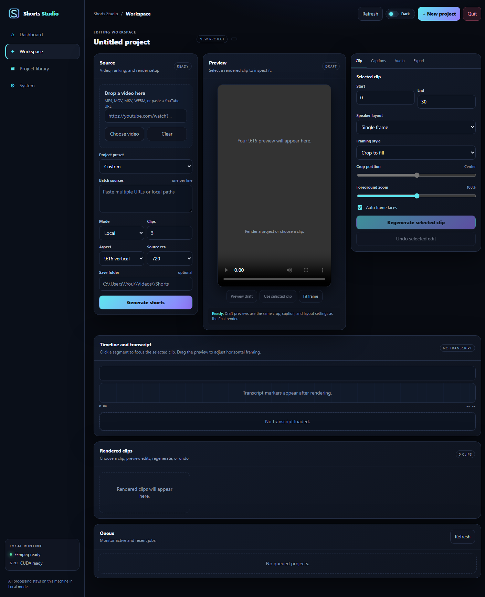
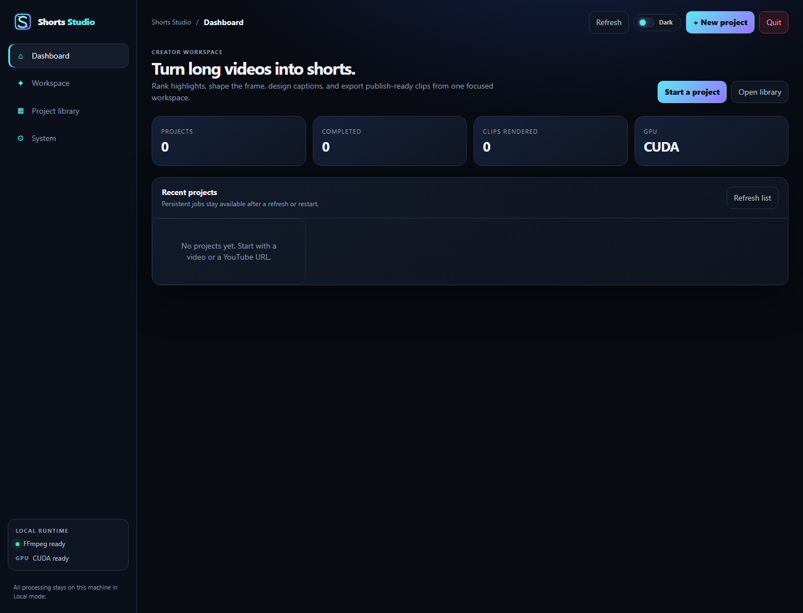
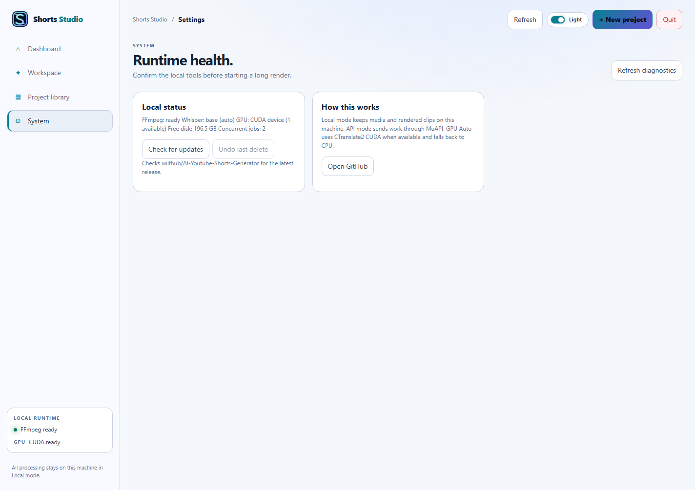

# Shorts Studio user guide

This guide covers the v1.0.0 beta workflow.  The desktop bundle and the
container expose the same API and workspace.

## 1. Start a project

1. Open Shorts Studio and confirm the **Runtime diagnostics** card reports
   FFmpeg and the selected Whisper device as ready.
2. Drop a local video into the source panel or paste a YouTube URL.
3. Choose Local mode for CPU/GPU processing, or API mode when a MuAPI key is
   configured.  Select the number of clips, aspect ratio, language, and any
   caption/branding options.
4. Select **Generate shorts**.  Progress updates appear live while the
   transcript, highlights, and clips are produced.



The workspace screenshot covers source selection, Local/CPU fallback, render
progress, framing, captions, audio cleanup, and the export panel.

## 2. Review and edit

Open a completed project from the library.  The preview, transcript timeline,
captions, multi-cut ranges, and bounded undo/redo history are available in the
workspace.



The dashboard screenshot covers the project library, queue, retry/cancel
states, and opening a completed project.

Use the export presets for YouTube Shorts, TikTok, Instagram Reels, or a
square/feed deliverable.  The original source and completed clips remain in
the configured output folder.

## 3. Back up and restore

Use **Settings > Backup** to download a metadata backup.  Enable the optional
media switch only when the archive should carry generated clips; media backups
are bounded to 512 MB and never include provider credentials. Restore merges
new project IDs and automatically migrates older project formats.

For scripted deployments, inspect first and then apply migrations:

```powershell
python scripts/migrate_data.py --data-dir C:\path\to\shorts-data
python scripts/migrate_data.py --data-dir C:\path\to\shorts-data --apply
```

## 4. Build a Shorts Factory package

For a reviewable end-to-end package, submit the same local path or YouTube URL
to `POST /api/v1/factory/jobs` (the request body is the normal job request).
When the job reaches **done**, open `GET /api/v1/jobs/{id}/factory` or download
the project export. The package contains safe clip URLs, hooks, generated
captions, thumbnails, creator metadata, and handoff plans for each supported
platform. Local absolute paths and credentials are never placed in the
manifest.

Record a decision for one or more clips with
`POST /api/v1/jobs/{id}/factory/approve`:

```json
{"clip_indices": [0], "decision": "approved", "note": "Ready for review"}
```

An approved checkpoint only makes the clip eligible for the normal publishing
confirmation; it never starts an upload by itself. Rejected clips remain in the
package for auditability and cannot be published until a later approval.

## 5. Sign in with Google and publish to YouTube

Set `YOUTUBE_CLIENT_ID`, `YOUTUBE_CLIENT_SECRET`, and the matching redirect URI
from your Google Cloud OAuth client. In the Export panel, choose **Sign in
with Google**, complete consent in the Google window, and return to Shorts
Studio. The status endpoint is `GET /api/v1/youtube/oauth/status`; tokens are
kept only in this process and can be cleared with
`POST /api/v1/youtube/oauth/disconnect`. Existing connections should be
reauthorized after changing scopes.

YouTube publishing remains approval-first. Select a completed clip, review the
title, description, clip, privacy, schedule, thumbnail, and captions, check the
review confirmation, and then submit the publish request with `confirm=true`.
Uploads use the resumable API and can attach an image thumbnail plus an SRT or
VTT caption track. Scheduled uploads remain private until the scheduled time.

Unattended publishing is off by default. It requires both the request's
`auto_publish=true` and `SHORTS_YOUTUBE_AUTO_PUBLISH=true`; an unattended public
upload additionally requires `allow_public=true` and
`SHORTS_YOUTUBE_ALLOW_PUBLIC_AUTOPUBLISH=true`. Every completed attempt is
recorded in the project's credential-free publishing audit log.

## 6. Publish and measure

Publishing is approval-first and private by default.  The **Publishing**
catalog shows whether YouTube, TikTok, or Instagram credentials are connected.
TikTok accepts a local rendered MP4 through its Content Posting API.  Instagram
Reels requires a public HTTPS `media_url`, because Meta fetches the video from
that URL.  Tokens stay in process memory and are never written to projects.

In the Export panel, choose TikTok or Instagram Reels, connect the account,
select a clip or variant, and approve a private upload. TikTok sends the local
rendered MP4 through the Content Posting API. Instagram requires a public
HTTPS `media_url` so Meta can fetch the video; a local path is never sent.

Create metadata variants for a clip with **Create variant from selected clip**.
Record views, likes, comments, and completion percentage in the analytics
controls. The feedback response compares retention and engagement and gives an
explainable next step; it never changes a project automatically.

## 7. Versioned API

New integrations should use `/api/v1/`.  The older `/api` paths remain as a
compatibility surface and return `Deprecation: true`, a `Sunset` date, and a
`Link` header pointing to the v1 equivalent.  OpenAPI is available at
`/docs` and `/openapi.json`; the error catalog is at `/api/v1/errors`.



The diagnostics screenshot covers FFmpeg/FFprobe, Whisper, CUDA/CPU fallback,
free space, and the refresh action.
